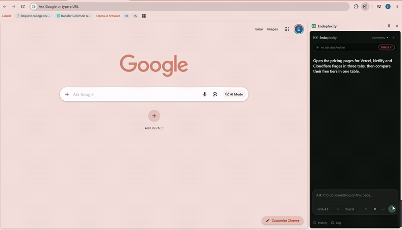

<div align="center">


# Endoplexity

**Agentic browser control, driven by the AI subscription you already pay for.**

A Chrome side panel that reads and acts on the page you're actually looking at:
click, type, fill forms, move between tabs, all through your existing `claude`
or `cursor-agent` CLI instead of a metered API key.

[](LICENSE)
[](package.json)
[](bridge/test)
[](#what-it-costs)



<sub>Real time, no cuts beyond a trim and a speed-up · <a href="docs/demo.mp4">full-quality video</a></sub>

</div>

---

## What you just watched

One instruction: *"Open the pricing pages for Vercel, Netlify and Cloudflare
Pages in three tabs, then compare their free tiers in one table."*

It opened three tabs, read each pricing page, followed a plan link that
actually lived on a different page, noticed when a link took it somewhere
unexpected and recovered from it, then came back with a comparison table, the
sources it used, and a takeaway naming the trade-off between Cloudflare's
unlimited static bandwidth and Netlify's credit cap.

That banner reading *"Endoplexity started debugging this browser"* is
Chrome's own, and it stays up the whole time. This is your real browser, your
real session, on the pages you already had open. Not a headless copy that
has to log back in to everything.

## Why this exists

Most open-source "browser agent" projects need an API key and bill you per
click. But if you already pay for Claude or Cursor, a tool-calling agent loop
is sitting on your machine right now, fully paid for, doing nothing.

The brain didn't need building. What was missing was **hands** (a browser it
can actually touch) and a **face** (a panel that shows its work). That's the
whole project: a tool server and a UI. The agent loop is the CLI you already
have installed.

## How it works

The extension never talks to a model directly. The CLI never talks to
Chrome. Neither one holds the other's credentials.

```
┌──────────────────────┐   WebSocket    ┌──────────────┐    MCP/HTTP   ┌──────────────────┐
│  Chrome side panel   │  origin-pinned │ local bridge │  token-gated  │  claude -p       │
│  (MV3)               │◄──────────────►│  127.0.0.1   │◄─────────────►│  cursor-agent -p │
│  owns chrome.debugger│                │  :8787       │               │  (the agent loop)│
└──────────────────────┘                └──────────────┘               └──────────────────┘
```

The panel owns the CDP connection itself rather than handing it to the
service worker, which sidesteps MV3's idle teardown. The bridge exposes 14
browser tools over MCP, and it's where the safety policy actually lives.
Never in a prompt, so nothing the model says can widen its own permissions.

**Tools:** `snapshot` `navigate` `click` `type` `key` `upload` `read_file`
`select` `scroll` `hover` `back` `forward` `tabs` `use_tab`

Two decisions do most of the work here:

- **Pages go to the model as an accessibility-tree snapshot, not raw HTML.**
  It's what the model actually needs, at a fraction of the bytes.
- **Actions return the page they produced**, so acting and re-reading happen
  in one turn instead of two. After the first read, only the lines that
  changed get sent again.

`read_file` reads a configured document as text (PDF, DOCX, XLSX, PPTX, CSV,
JSON, Markdown, or plain text), so the agent can answer questions *about* an
attachment instead of only pushing it into a form field.

## Getting started

This takes about five minutes. No API key, no billing page, no dashboard to
configure. Just Node, Chrome, and a CLI you probably already have logged in.

### 1. Check what you need first

- **Node 24 or newer.** The bridge runs TypeScript directly, no build step,
  and that only works on 24+. Check with `node -v`.
- **Chrome 114 or newer.** 135+ gets themed dropdowns; anything older just
  falls back to the native picker, nothing breaks.
- **The `claude` CLI, the `cursor-agent` CLI, or both**, already logged in to
  a real subscription. A **Claude Pro** plan is enough (you don't need Max);
  pick Sonnet in the model dropdown once you're running, since reading a page
  and clicking things doesn't need a frontier reasoning model.

### 2. Clone it and install

```bash
git clone https://github.com/Endokelp/Endoplexity.git
cd Endoplexity
npm install
```

### 3. Start the bridge

```bash
npm run setup
```

This writes a small launcher into your Windows Startup folder, so the bridge
comes up automatically every time you log in. No console window stays open,
no token to copy anywhere. If you'd rather run it by hand instead (or you're
not on Windows), `npm start` runs it in the foreground so you can watch its
log directly. If something ever seems stuck, `.endo-bridge.log` at the repo
root is the first place to look.

### 4. Load the extension into Chrome

1. Open `chrome://extensions`
2. Turn on **Developer mode** (top right)
3. Click **Load unpacked**
4. Select the `extension/` folder from this repo

You'll see the Endoplexity icon appear in your toolbar.

### 5. (Optional) Log in to Cursor too

Only needed if you want to run tasks through Cursor's models as well as
Claude's:

```bash
npm run cursor-login
```

This is a one-time login into a bridge-owned Cursor profile, kept separate
from your normal `cursor-agent` login so the two never collide.

### 6. (Optional) Let it read your files

If you want the agent to attach or read a document, resume, or spreadsheet
during a task, copy the example config and point it at your file:

```bash
cp .endo-files.example.json .endo-files.json
```

Then edit `.endo-files.json` and add a path, for example:

```json
{
  "resume": "C:\\Users\\you\\Documents\\resume.pdf"
}
```

The model only ever sees the key (`resume`), never the path. This file is
gitignored, so it stays on your machine.

### 7. Run your first task

Click the Endoplexity icon to open the side panel, type what you want, and
hit **Run**. A couple of things worth knowing right away:

- `Enter` starts a fresh task. `Ctrl`/`Cmd`+`Enter` replies inside the
  current conversation instead of starting over.
- Type `@` in the box to hand the agent another tab you have open.
- A fresh Run always attaches to whichever tab you're currently looking at,
  so open the page you want it working on *before* you press Run.

Try something low-stakes first, like summarizing whatever page you're on
before you point it at a form. For a deeper look at what each part of the
panel shows and how the approval gate behaves, see
[docs/handrun.md](docs/handrun.md).

## The safety model

This drives a browser that's logged into your real accounts, so the
boundaries here are worth stating plainly, including where they stop.

- **Loopback only.** The bridge binds `127.0.0.1`, never `0.0.0.0`.
- **The panel is identified by origin, not a shared secret.** The extension
  ID is pinned by an RSA `key` in the manifest, and the WebSocket upgrade has
  to match that exact origin. Page script can't forge an `Origin` header.
  The `/mcp` endpoint, which a CLI reaches with no origin at all, is gated
  instead by a token in a `0600` gitignored file, never passed on a command
  line.
- **The agent gets browser tools and nothing else.** Claude runs with an
  explicit allowlist plus `--strict-mcp-config --setting-sources ""`; Cursor
  runs in an isolated profile with `Shell`, `Write`, `Read`, and `WebFetch`
  all denied. Both were verified by actually trying to run a shell command,
  not by reading the documentation and hoping.
- **Irreversible actions stop for a human.** Submitting, deleting, and
  purchasing all hit an approval gate that lives in the bridge. Silence
  denies. A disconnected panel denies.
  **Know exactly what that check is:** it matches the clicked element's
  visible label against a list of English words (`submit`, `pay`, `delete`,
  `confirm`, and a few more). It's a label heuristic, not real understanding
  of the page. A button labelled in another language, worded unusually
  ("Finish", "Yes, place it"), or carrying only an icon will **not** be
  caught. Use `watch` mode where that matters.
- **Three autonomy modes** (`watch` / `normal` / `trust`), chosen in the
  panel and enforced in the bridge. An absent or unrecognised mode falls
  back to `normal`, never `trust`, so it fails closed. `trust` disables the
  gate entirely, which is why the panel shows it in red the whole time it's
  set. *(The demo above runs in `trust` mode, which is why you never see the
  gate fire.)*
- **Files resolve a configured key, never a model-supplied path.**
  `DOM.setFileInputFiles` runs in the browser process and can read almost
  anything, so a model-chosen path would be an exfiltration primitive. Note
  the asymmetry: `upload` hands a file to a page without the model ever
  seeing its contents, but `read_file` puts those contents directly in the
  model's context. That allow-list is the whole boundary, so only put in it
  what you actually mean to share.

Found a hole? See [SECURITY.md](SECURITY.md) and please report it privately.

## What it costs

A complete job application, filled agent-driven on a real Greenhouse form:

| | |
|---|---|
| Cost | **$0.0959** |
| Tokens | 112,064 |
| Turns | 10 |
| Wall clock | 42s |

That dollar figure is what the CLI reports as *equivalent* API spend. On a
subscription, it's already covered by what you're paying monthly, which is
the entire point of this project.

The same task measured flat against a 5-tool baseline, even while carrying
about 18k tokens more of tool schema, so going from 5 tools to 13 cost
nothing per run in practice. Page returns were later cut **3.8x** by sending
a full page once and then only the lines that changed afterward: 119,856 →
31,626 tokens on a ten-turn Hacker News task.

## Status

Early. `v0.0.1`, and honest about it. The tool layer, approval gate, session
continuity, and panel are all built and tested: **156 unit tests**, plus an
in-panel self-test that drives the real CDP layer against a cross-origin
fixture (run `await endo.selftest()` in the panel's own console).

Known gaps, stated rather than hidden:

- **Windows-first.** `npm run setup` installs autostart via a Startup-folder
  script. macOS and Linux autostart aren't implemented yet, though the
  bridge itself is portable and `npm start` works anywhere.
- **Sessions live in the bridge's memory.** Restarting it ends resumability
  on purpose: resuming into a Chrome that's moved on would hand the agent a
  transcript full of stale element references.
- Real ATS comboboxes usually aren't `<select>` elements, so they need a
  click-then-click flow rather than the `select` tool.
- `chrome://` pages and the Web Store can't be driven, since Chrome refuses
  the debugger there.
- After a lot of navigation, dead out-of-process iframe sessions can leave a
  stray line of noise in a snapshot.

## Development

```bash
npm test     # 156 tests, node:test, no framework, no build step
npm start    # run the bridge in the foreground to watch its log
```

There's no bundler and no framework here. The extension is plain HTML and
JS, and the bridge is TypeScript run directly by Node 24.

[docs/handrun.md](docs/handrun.md) is the manual verification checklist.

## Licence

[Apache-2.0](LICENSE). See [NOTICE](NOTICE) for trademark attribution.

> Independent project. Not affiliated with, endorsed by, or sponsored by
> Perplexity AI, Anthropic, or Anysphere.
